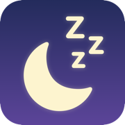
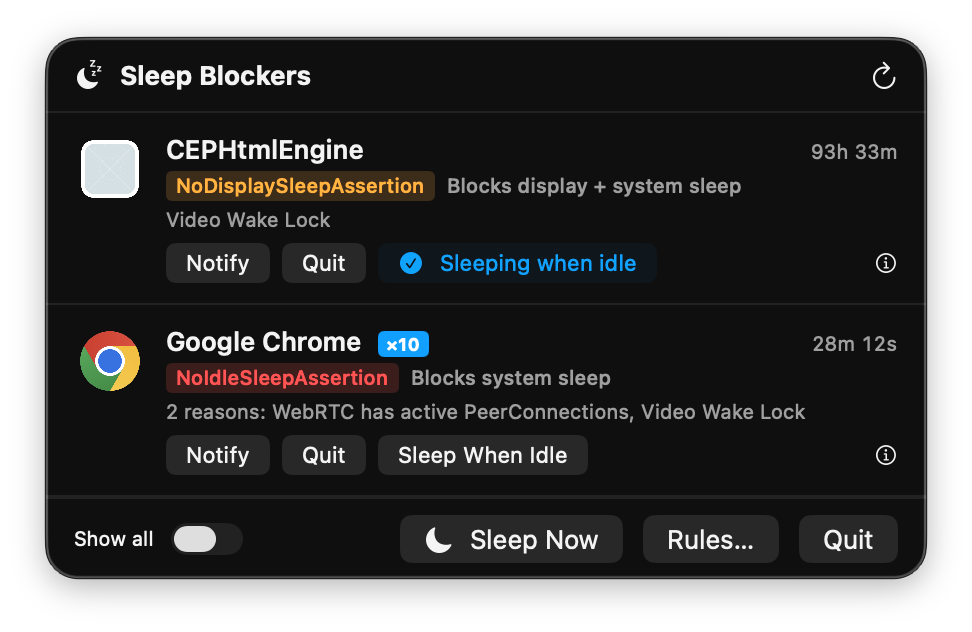
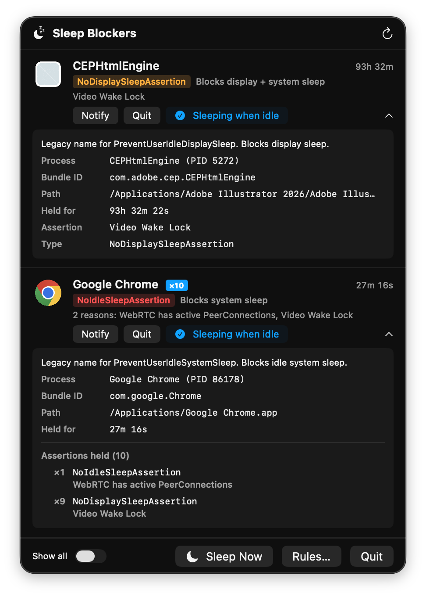
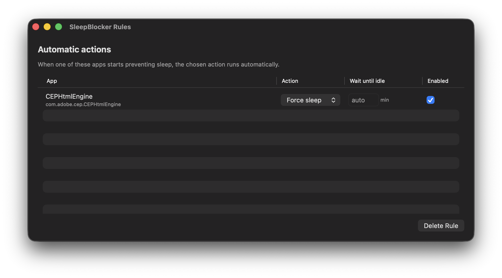

<p align="center">
  
</p>

<h1 align="center">SleepBlocker</h1>

<p align="center">
  <strong>See what's keeping your Mac awake — and shut it up.</strong>
</p>

<p align="center">
  <a href="#install"></a>
  
  
  
</p>

<p align="center">
  <a href="#install">Install</a> —
  <a href="#features">Features</a> —
  <a href="#screenshots">Screenshots</a> —
  <a href="#how-it-works">How it works</a> —
  <a href="#build-from-source">Build</a>
</p>

---

## Install

### Direct download

1. Download the latest **SleepBlocker-x.y.z.dmg** from the [Releases page](https://github.com/jclusso/sleep-blocker/releases).
2. Open the DMG and drag **SleepBlocker** into the **Applications** folder.
3. **First launch:** macOS will block the app and show *"can't be opened because Apple cannot check it for malicious software"* — because the app isn't signed with an Apple Developer ID ([why not?](#why-the-gatekeeper-warning)). To approve:
   - Open **System Settings → Privacy & Security**.
   - Scroll down to the row that says *"SleepBlocker was blocked"* and click **Open Anyway**.
   - Confirm in the dialog that appears. After this one-time approval, the app opens normally forever.
4. Look for the moon icon in your menu bar.

*(If you're on macOS 13 or 14, you can also right-click the app → Open → Open instead. Apple removed that shortcut in macOS 15 Sequoia.)*

### Build from source

Requires Xcode command-line tools and macOS 13+.

```sh
git clone https://github.com/jclusso/sleep-blocker
cd sleep-blocker
make run
```

To produce a distributable DMG:

```sh
make dmg
```

## Features

- 🌙 **Live list of sleep blockers** — every process holding an IOKit power assertion, refreshed every 2 seconds while the popover is open (5s in the background). The duration and idle counters tick every second via `TimelineView`.
- 🧠 **Plain-English explanations** — each assertion gets a human-readable summary. `NoIdleSleepAssertion` → "Blocks system sleep." `NoDisplaySleepAssertion` → "Blocks display + system sleep." No more deciphering `pmset -g assertions`.
- 📦 **Per-process grouping** — one row per offending app, even when Chrome holds ten `Video Wake Lock` assertions at once. The ⓘ detail panel lists every assertion type and reason under that process.
- 🔔 **Notify / Quit / Sleep When Idle** — three rule-creating toggles on every offender. Each button persists a rule so next time that app asserts, it's handled automatically. Same app can have multiple rules at once (notify *and* auto-sleep).
- ⏱ **Idle-aware auto-actions** — every rule has a "wait until idle" threshold in minutes (decimals allowed: `0.1` = 6s for quick testing). Default matches your macOS `displaysleep` setting. Rules fire only after you've been genuinely idle for that long.
- 🛡 **Honors other apps' assertions** — a Force Sleep rule for Chrome will *not* fire if something else (Google Meet in a call, a driver, some app you haven't set a rule for) is also holding the system awake. It defers to anything SleepBlocker doesn't explicitly know about.
- 🔁 **Cooldown resets when you return** — you get one notification per "I walked away" event, not one per cooldown window. Touch the keyboard and the next idle period earns a fresh notification.
- 💾 **Remembers offenders** — persistent rules in `~/Library/Application Support/SleepBlocker/rules.json`. Flag Chrome once, have it handled forever.
- 🚫 **System-owned assertions are read-only** — `powerd`, `coreaudiod`, `WindowServer` and friends can't be accidentally SIGKILLed.
- 😴 **Sleep Now** — one-click immediate sleep in the footer, for when you want it right now regardless of assertions.
- 🚀 **Launches at login automatically** — registers via `SMAppService` on first launch. Disable any time via System Settings → General → Login Items.
- 🖼 **Offender icon in every notification** — notifications include the culprit app's icon (Chrome, Illustrator, whatever) as an attachment so you know who it's about at a glance.

## Screenshots

<p align="center">
  
</p>

<p align="center">
  <em>The moon icon badge fills in whenever something is blocking sleep. Click to see what.</em>
</p>

<p align="center">
  
</p>

<p align="center">
  <em>Tap ⓘ on any row to see the assertion type breakdown, bundle ID, and held-for duration.</em>
</p>

<p align="center">
  
</p>

<p align="center">
  <em>Rules remember offenders — set an idle threshold and SleepBlocker will handle them automatically.</em>
</p>

## Why I built this

My Mac doesn't sleep. My monitors don't sleep. The chief culprit on my setup is Chrome — kept wide awake by my UniFi security camera web interface streaming live feeds from a background tab — and Adobe's `CEPHtmlEngine` helper, which cheerfully holds a "Video Wake Lock" for 92 consecutive hours at a time for reasons known only to Adobe. The machine never powers down, the panels stay lit 24/7, burn in progresses, and the power draw hums along all night.

macOS's built-in tools don't help much. Activity Monitor's "Preventing Sleep" column only tells you *which app*, not *which tab* or *why*. `pmset -g assertions` knows the real answer, but the output is cryptic and the only fix it offers is "quit the app." Chrome, Slack, Google Meet, every Adobe product, and plenty of niche web apps (camera dashboards, status pages, internal tools) routinely hold sleep assertions for hours after the work that took them is done.

So I built SleepBlocker: a menu bar list of the actual culprits, plain-English explanations of what each assertion does, and one click to shut them up — either right now, or automatically the next time I walk away.

## How it works

macOS tracks "power assertions" — requests from processes asking the system not to sleep. You can see them with `pmset -g assertions`, but the output is dense and the only action it gives you is to quit the process manually.

SleepBlocker reads the same assertions via the public `IOPMCopyAssertionsByProcess` IOKit API, enriches each entry with the owning app's name and icon, and presents them in a menu bar popover with actions.

### An honest limit

**macOS does not let one process release another process's power assertion.** Assertions are owned by the creator. So SleepBlocker can never "block" an app from asserting — it can only:

1. **Quit the offending process** (graceful `NSRunningApplication.terminate()`, SIGKILL fallback after 3s)
2. **Force the Mac to sleep** via `pmset sleepnow`, bypassing all assertions momentarily
3. **Notify you** so you can decide what to do

The **Sleep When Idle** feature combines (2) with an idle check: if a flagged app is asserting AND you've been idle past your configured threshold (defaults to your macOS `displaysleep` setting), SleepBlocker fires `pmset sleepnow`. Your Mac sleeps, the assertion's effect is neutralized until wake.

### Idle detection

SleepBlocker uses the same idle signal macOS's own `powerd` uses to decide when to sleep: `HIDIdleTime` from the `IOHIDSystem` IOService, readable from the shell via `ioreg -c IOHIDSystem | grep HIDIdleTime`. It counts nanoseconds since the last HID event (mouse, keyboard, scroll, trackpad). If macOS considers you active, SleepBlocker does too.

That means SleepBlocker's notion of "idle" matches macOS's: your hand on the mouse — even without clicking — resets the counter, because any pointer movement is a HID event.

### Force-sleep safety

Before firing `pmset sleepnow` due to a rule, the engine checks whether *any* currently-asserting app is **not** covered by one of your rules. If there's an unruled blocker (say, Google Meet in a live call, or an audio driver), force-sleep is skipped that round. The mental model: "rules are for apps I've explicitly told SleepBlocker to override — anything else probably has a legitimate reason to keep the Mac awake, defer to it."

## Why the Gatekeeper warning?

Apple requires a $99/year Developer ID certificate to sign apps in a way that skips the "unidentified developer" prompt. SleepBlocker is free and currently unsigned, so downloaded copies trip Gatekeeper on first launch. The one-time **Open Anyway** approval in System Settings permanently whitelists the app. (Apps you build from source locally don't hit this at all — Gatekeeper only checks apps that arrived with a download quarantine attribute.)

## Tech

- **Swift 6** + SwiftUI `MenuBarExtra` (macOS 13+)
- **IOKit** (`IOPMCopyAssertionsByProcess`) for assertion data
- **AppKit** (`NSRunningApplication`, `NSWorkspace`) for process/icon resolution
- **CoreGraphics** (`CGEventSource.secondsSinceLastEventType`) for idle detection
- **UserNotifications** for notification actions
- No Xcode project — builds directly with `swiftc` via a `Makefile`. One binary, ~520KB.

## Project layout

```
sleep-blocker/
├── Sources/
│   ├── SleepBlockerApp.swift     # @main, MenuBarExtra + Rules window
│   ├── AssertionReader.swift     # IOKit IOPMCopyAssertionsByProcess bridge
│   ├── AssertionMonitor.swift    # Polling timer, published state
│   ├── AssertionGroup.swift      # Per-PID grouping + severity ranking
│   ├── AssertionInfo.swift       # Plain-English assertion summaries
│   ├── SleepAssertion.swift      # Model
│   ├── ProcessResolver.swift     # PID → app name / bundle ID / icon
│   ├── IdleMonitor.swift         # CGEventSource idle detection (filtered)
│   ├── SystemSleepSettings.swift # Reads pmset displaysleep setting
│   ├── Rule.swift                # Rule model + matching/glob
│   ├── RuleStore.swift           # rules.json persistence
│   ├── RuleEngine.swift          # Evaluates rules, cooldowns, safety
│   ├── Actions.swift             # Notify / Quit / Force Sleep
│   ├── LaunchAtLogin.swift       # SMAppService one-shot registration
│   ├── DebugLog.swift            # Local file log for debugging
│   ├── MenuContent.swift         # Popover root view
│   ├── AssertionRow.swift        # Per-offender row with action buttons
│   └── RulesWindow.swift         # Table of persistent rules
├── Resources/Info.plist          # Bundle metadata
├── scripts/
│   ├── make_icon.swift           # Generates AppIcon.icns at build time
│   └── make_dmg.sh               # Styles the install DMG
└── Makefile                      # all / run / dmg / release
```

A debug log is written to `~/Library/Application Support/SleepBlocker/debug.log` — useful if you hit "why didn't my rule fire?" and want to see the engine's per-poll decision trail (idle time, cooldown state, threshold comparisons, firing events).

## Contributing

Issues and PRs welcome. For bugs, please include the output of `pmset -g assertions` so the offender is reproducible.

## License

[MIT](LICENSE). Use it, fork it, ship it.
